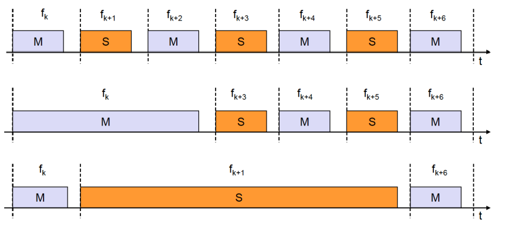
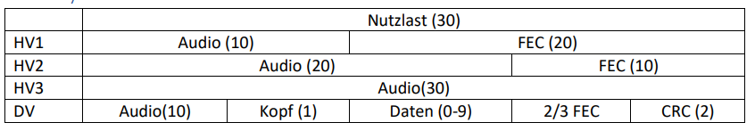

# Bluetooth

## Bluetooth Eigenschaften

- Universal für Ad-Hoc
- Sprach-/Datenübertragung, ca. 1 Mbit/s (brutto)
- 2,4 GHz, 79 RF Kanäle, 1 MHz Trägerabstand
- G-FSK Modulation
- 1-100 mW Sendeleistung
- Stromaufnahme: 20µA - 40 mA

## Topologie

Überlappende Pikonetze (Sterne) bilden ein Scatternet (Streunetz)

## FHSS

Frequency Hopping Spread Spectrum

- 1600 Sprünge/s => 625µs
- Pseudozufällig, Vorgabe durch Master

## TDD

Time Division Duplex

## Sprache

- Keine Übertragungswiederholung
- 64 kbit/s duplex
- Punkt-zu-Punkt
- Leitungsvermittelt

## SCO

Synchronous Connection Oriented

## FEC

Forward Error Correction

## ACL

 Asynchronous Connectionless

## Daten

- Schnelle Bestätigung
- Punkt-zu-Mehrpunkt
- Symmetrisch: 433,9 kbit/s
- Asymmetrisch: 723,2/57,6 kbit/s
- Paketvermittelt

## Frequenzwahl wärend Übertragung

## SCO Aufbau

## ACL Eigenschaften

- Nutzlasttypen
- DM Kopf, Nutzlast, FEC, CRC
- DH Kopf, Nutzlast, CRC
- AUX Kopf, Nutzlast, CRC

