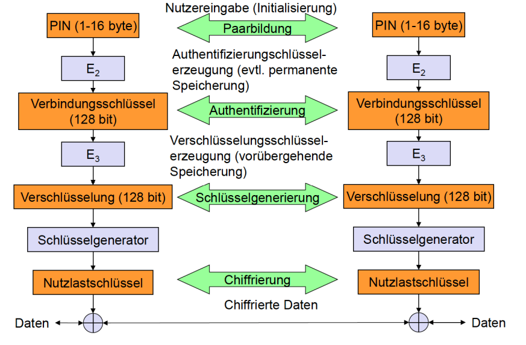

# Verbindungstypen

## Polling-basiert

- TDD, paketorientierte Übertragung
- 625µs Zeitschlitze
- Master fragt Slaves ab

## SCO – Synchronous Connection Oriented – Sprache

- Periodische Pakete
- Ein Zeitschlitz
- 64 kbit/s vollduplex
- Punkt zu Punkt

## ACL – Asynchronous Connectionless – Daten

- Variable Paketgröße (1/3/5 Zeitschlitze)
- Asymmetrische Bandbreite
- Punkt-zu-Mehrpunkt

## Robustheit

- Frequency Hopping, FH-CDMA, Trennung von Pikonetzen
- Übertragungswiederholung (bei ACL sehr schnell)
- Vorwärtsfehlerkorrektur (SCO und ACL)

## Zustände eines Bluetoothgerätes

## L2CAP

Logical Link Control and Adaption (IIII.20)

## Sicherheit

## SDP (Abkürzung)

Service Discovery Protocol

## SDP Zweck

Suche und Erkennung von Diensten

- Definiert Entdeckung, nicht Nutzung
- Zwischenspeicherung erkannter Dienste

## SDP Dienstbeschreibung

- Information über Dienste als Attribute
- Attribute: 16-Bit-Kennung (Name) und Wert
- Kennung kann von 128 Bit UUID abgeleitet werden

## RFCOMM

- Emulation einer seriellen Schnittstelle
- Kann mehrere Schnittstellen über physikalische Verbindung anbieten

## TCS

Telefony Control Protocol

- Verbindungssteuerung (Setup, Release)
- Gruppenverwaltung

## Bluetooth OBEX

 Object Exchange

- Objektaustausch, IrDA-Ersatz

## Bluetooth WAP

Wireless Access Protocol

- Interaktion mit Anwendungen auf Mobiltelefonen

## Bluetooth Profile

Standardlösungen für Szenarien

- Generic Access Profile
- Service Discovery Application Profile
- Cordless Telefphony Profile
- Intercom Profile
- Serial Port Profile
- Headset profile
- Dial-up Networking Profile
- Fax Profile
- LAN Access Profile
- Generic Object Exchange Profile
- Object Push Profile
- File Transfer Profile
- Synchronization Profile
- Advanced Audio Distribution 
- PAN
- Audio Video Remote Control
- Basic Printing
- Basic Imaging
- Extended Service Discovery
- Generic Audio Video Distribution
- Hands Free
- Hardcopy Cable Replacement
