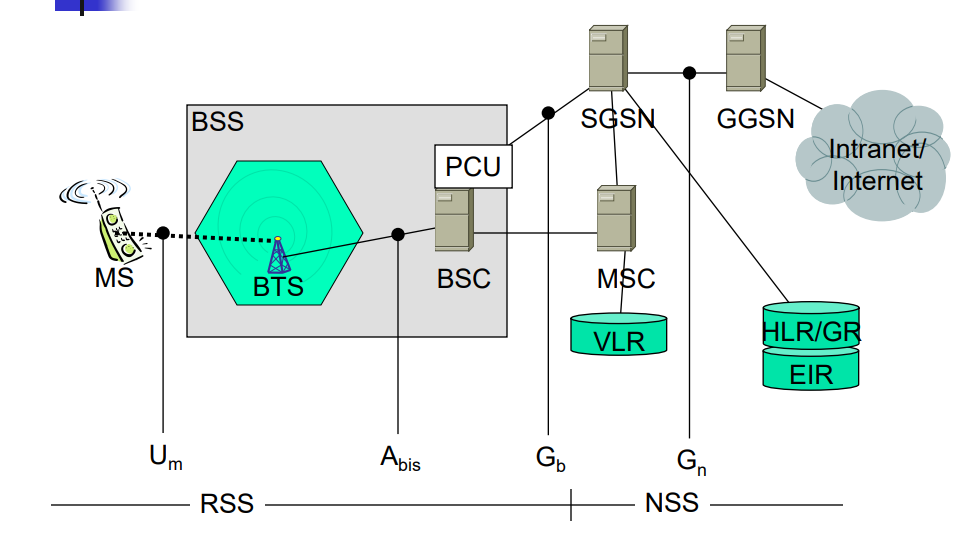

# GPRS

## Gprs

General Packet Radio Service

## GSN

GPRS Support Nodes

## GGSN

Gateway GSN

- Umsetzung GPRS zu PDN (Paket Data Network)

## SGSN

Serving GSN

- Untersützung der MS (Lokation, Abrechnung, Sicherheit)

## GR

GPRS Register

- Benutzeradressen

## PCU

Packet Control Unit

## GPRS Architektur

