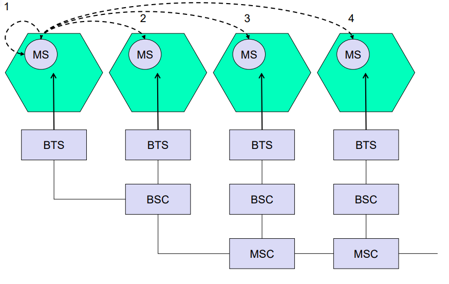

# Handover

## Gründe für Handover

- BSS überwacht Verbindung
- Gründe für Handover
    Bewegung der MS
    Funkfeldmessung: Fehlerrate, Dämpfung, Ausbreitungsverzögerung
    Hohe Verkehrslast
    Wartungsmaßnahmen
    Verbesserung des globalen Interferenzlevels (Confinement Handover)

## Handovertypen

- 1/2 Intra BSC
- 3 Inter BSC Wechsel der BSC
- 4 Inter MSC Wechsel der MSC
- MS meldet alle s 6 mögliche Zellen
- BSC ist Entscheidungsträger

