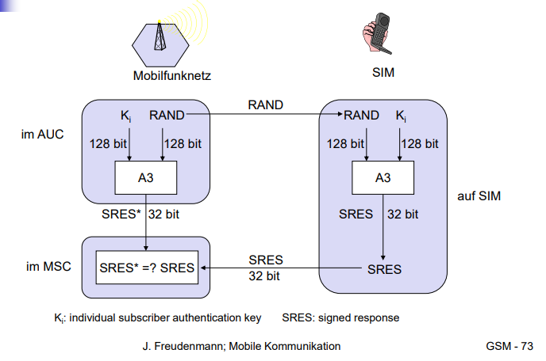

# Sicherheit

## GSM Zugangskontrolle / Authentifikation

- Teilnehmer  SIM PIN
- SIM  Netzwerk Challenge-Response-Verfahren

## GSM Vertraulichkeit

Verschlüsselung aller Daten (Sprache, Signalisierung)

## GSM Anonymität

- Temporäre Kennung (TMSI)
- Neu bei Location Update (LUP)
- Verschlüsselt übertragen

## GSM A3

 zur Authentisierung („geheim“, Schnittstelle offengelegt)

## GSM A5

zur Verschlüsselung (standardisiert)

## GSM A8

 zur Schlüsselberechnung („geheim“, Schnittstelle offengelegt)

## GSM Ablauf Authentifikation

## GSM Ablauf Verschlüsselung

