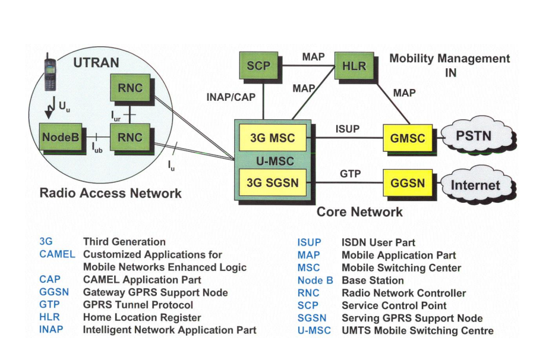
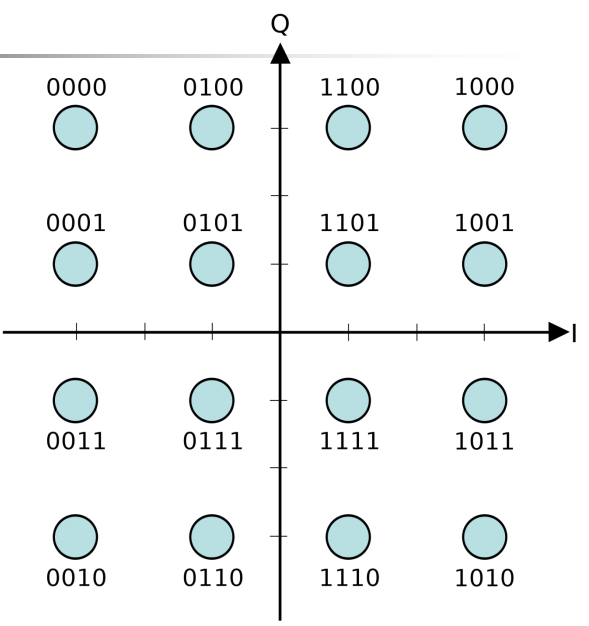

# Umts

## UMTS

Universal Mobile Telecommunications System

## UTRA

UMTS Terrestrial Radio Access

- -FDD Frequency Division Duplex
- -TDD Time Division Duplex
- Basis CDMA

## Einsatzszenarien

- 2048 kbit/s Stationär, kurze Entfernung
- 384 kbit/s mobil, kleine Zellen (Ballungsraum)
- 144 kit/s mobil, große Zellen (ländl. Raum)

## UMTS Architektur

## Codemultiplex

Ziel: Bandbreite erhöhen, Amplitude senken => Störanfälligkeit senken
    - Frequency Hopping
    - Pseudo Noise

## UMTS URTA-FDD

- Wideband-CDMA
- Uplink: 1920- 1980 MHz
- Downlink: 2110 - 2170 MHz
- 12 Kanäle zu je 5 MHz
- Chipping rate: 3,84 Mchips/s
- Soft Handover (Kommunikation mit 2 BTC gleichzeitig)
- Lokalisierung auf 20 m
- Leistungssteuerung 1600 Tests/s

## UMTS UTRA-TDD

- W-TDMA/CDMA
- Kanalstruktur analog zu GSM, aber größere Bandbreite und zusätzlich CDMA
- E-UTRA-Band 33: 1900 - 1920 MHz
- E-UTRA-Band 34: 2010 - 2030 MHz
- 4 Kanäle zu je 5 MHz
- Chipping rate: 2,56 Mchips/slot, 1 Slot = 625µs
- Genaue Synchronisation notwendig
- Leistungssteuerung 100-800 Tests/s

## UMTS HSPA

High Speed Packet Access

## UMTS HSPA Eigenschaften

- HSDPA High Speed Downlink Packet Access
- HSUPA High Speed Uplink Packet Access
- Verbesserte Modulation analog zu Edge

## LTE

Long Term Evolution

## LTE Eigenschaften

- Kompatibel zu Vorgängern
- Schlankere Netzarchitektur
- Downstream: 100 Mbit/s
- Upstream: 50 Mbit/s
- Bandbreite bis 20 MHz
- Datendienst, IPv4

## 16 QAM

- 2 Signale Q, I
- Amplituden -3 … 3
- 90° Phasenverschiebung
- Graycode

