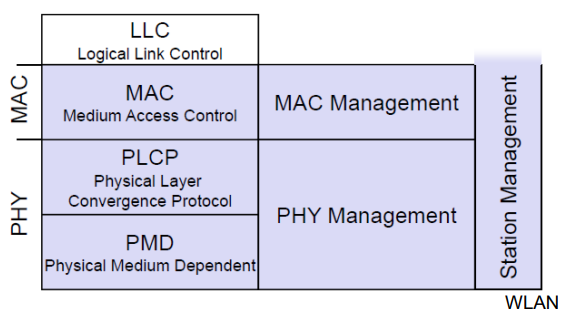

# Protokolle Mobil-Seite

## WLAN MAC

Zugriffsmechanismus, Fragmentierung, Verschlüsselung

## WLAN MAC Managment

Synchronisierung, Roaming, Management Information Base (MIB), Power

## WLAN PLCP

Physical Layer Convergence Protocol

- Clear Channel Assessment Signal (Carrier Sense)

## WLAN PMD

Physical Medium Dependant

- Modulation, Codierung

## WLAN PHY Management

Kanalwahl, MIB

## WLAN Station Management

Koordination der Management-Funktion

## WLAN Protokollstapel Mobil-Seite

