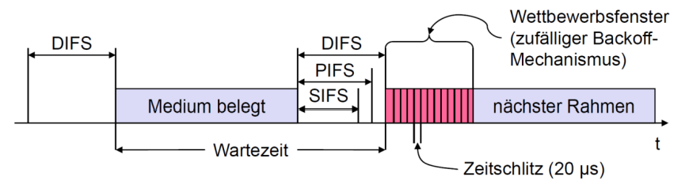
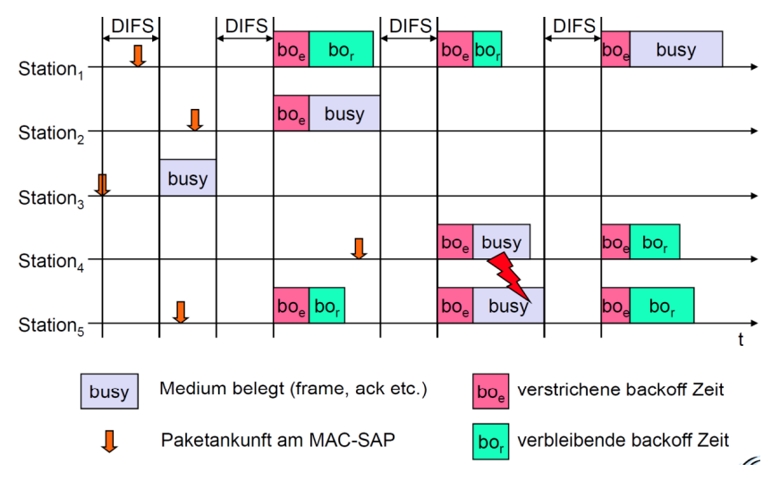
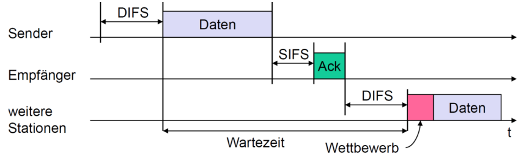
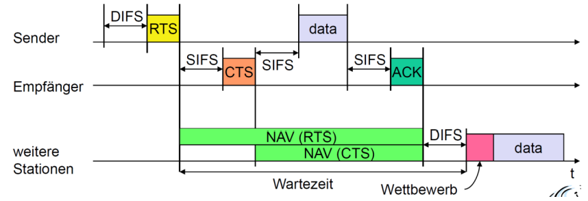

# Physikalische Schicht

## FHSS

Frequency Hopping Spread Spectrum

- Spreizen, entspreizen, nur 1 Mbit/s, 2-stufige GFSK-Modulation

## DSSS

Direct Sequence Spread Spectrum

- DBPSK (Differential Binary Phase PSK), 1 Mbit/s
- DQPSK (Differential Quadrature PSK), 2 Mbit/s
- max. 1 W (USA), 100 mW (EU), min. 1 mW

## DFWMAC

Distributed Foundation Wireless Media Access Control

## DFWMAC Verkehrsarten

- Asynchroner Datendienst (standard)
    Austausch von Datenpaketen („best-effort“)
    Broadcast und Multicast unterstützt
- Zeitbegrenzte Dienste (optional)
    Implementiert über PCF (Point Coordination Function)

## DFWMAC Zugriffsarten

- Mit CSMA/CA (standard)
    Kollisionserkennung durch zufälligen „back-off“
    Mindestabstand zwischen Paketen
    ACK (nicht bei Broadcast)
- Mit RTS/CTS (optional)
    Request to Send / Clear to Send
    Vermeidung des Problems „versteckter“ Endgeräte
- Mit PCF
    Point Coordination Function
    Polling-Verfahren mit einer Liste im Access Point

## DFWMAC Prioritäten

- Staffelung durch Zugriffszeitpunkte, keine Garantie
- => IFS Inter Frame Spacing
- SIFS Short IFS                                                10 µs
    Höchste Priorität, für ACK, CTS, Antwort auf Polling
- PIFS Point Coordination Function IFS                          30 µs
    Mittlere Priorität, für zeitbegrenzte Dienste mittels PCF
- DIFS Distributed Coordination Function IFS                    50 µs
    Niedrigste Priorität, für asynchrone Datendienste

## DFWMAC Prioritäten Schaubild

## WLAN Wettbewerb um Medium

## WLAN CSMA/CA

- Daten können nach Abwarten von DIFS gesendet werden
- Empfänger antworten sofort (nach SIFS), falls das Paket korrekt empfangen wurde (CRC)
- Im Fehlerfall wird das Paket automatisch wiederholt

## WLAN CSMA/CA Schaubild

## WLAN RTS/CTS

- RTS mit Belegungsdauer als Parameter kann nach Abwarten von DIFS gesendet werden
- Bestätigung durch CTS nach SIFS durch Empfänger
- Sofortiges Senden der Daten möglich, ACK wie gehabt
- Andere Stationen speichern die Belegungsdauer, die im RTS und CTS ausgesendet wurden

## WLAN RTS/CTS Schema

