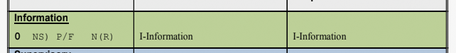
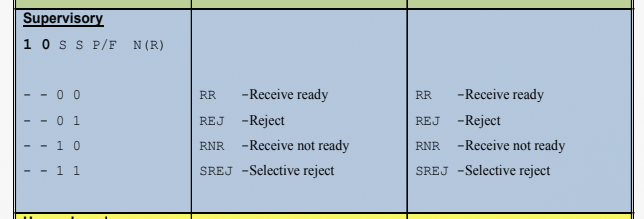
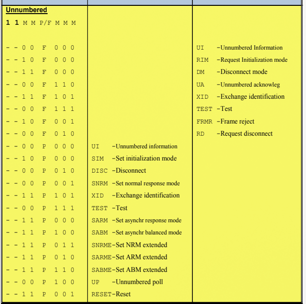

# Frameformate

## I Format: 

Information Transfer

- Zur Übertragung von Daten

- P Bit --> wenn P Bit auf 1 direkte Bestätigung des Empfangs gefordert

- Ns Count = Sende Counter, zählt gesendete Pakete

- Nr = Empfangscouonter, zählt korrekt empfangene Pakete

## S-Format

Supvervisory Format

benutzt zur 
- Empfangsbestätigung
- Flusskontrolle (Ready oder Busy)
- Meldung von Nummerierungsfehlern

## U-Format

Unnumbered Format

Auf und Abbau und Fehlerbenachrichtung

