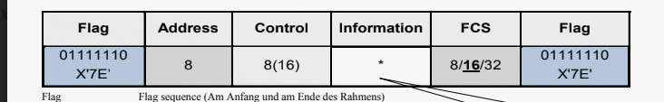

# HDLC

## Frameaufbau

- Flag
- Adresse
- Control
- Information (optional, enthält Daten)
- FCS
- Flag

!!Achtung HDLC sendet in Low Order Reihenfolge

Das MSB Bit kommt am Schluss. Reihenfolge der Bitfolge beachten.

Flag bei HDLC immer 0x7E

