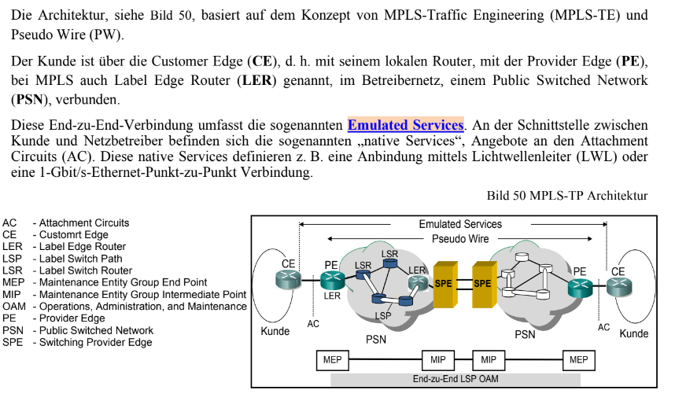
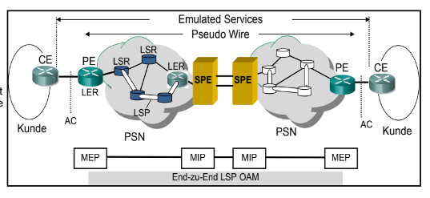
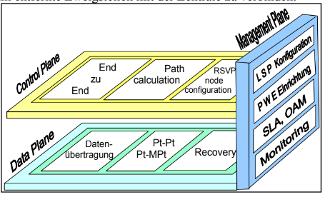

## MPLS-TE und TP

Erweitert MPLS um QoS und eine breitere Anwendung

Ermöglciht LSPs zwischen Providern die eigene MPLS Netze betreiben

## EMulated Services

Kunde bekommt von MPLS nicht mehr viel mit. Er benutzt einen "normale Anschluss". Mit MPLS-TP kann die Geschwindigkeit beispielsweise emuliert werden.

## Pseudo Wire Emulation Edge-to-Edge

Der Kunde bekommt ein virtuelles Kabel zwischen LER Routern. Erweiterung vom normalen Pseudo Wire

Mit MPLS-TP ist das Provider übergreifend.

## Trennung zwischen Kunden und Betreibernetz durch Planes

## Control Plane

Die Control Plane dient einem schnellen, dynamischen und zuverlässigen Service für eine Multi-Vendor-
Umgebung in einem Multi-Domain-Bereich. Durch die standardisierten Protokolle, wie z. B. RSVP oder das

Routing Protokoll OSPF, wird eine problemlose Zusammenarbeit über die verschiedenen Netze sicherge-
stellt.

In der Control Plane wird End-zu-End die notwendige Signalisierung durch u. a. RSVP-TE, das Routing

mittels OSPF oder IS-IS und das Traffic Engineering sichergestellt. Mit Hilfe des Label Distribution Proto-
kolls (LDP), beschrieben in RFC 3036, wird die Verteilung der Label Information zu den LSRs und LERs

vorgenommen. Außerdem unterstützt LDP auch noch die o. a. Routing-Protokolle.
Die Control-Plane-Topologie sollte unabhängig von der Data-Plane-Topologie sein.

## Data Plane

Die MPLS-TP Data Plane ist eine Teilmenge der MPLS Data Plane wie sie zurzeit bereits vorhanden ist. Die
Data Plane ist für die sichere Übertragung der Daten verantwortlich. Eine Recovery muss unabhängig von
der Control oder Management Plane erfolgen. Die Funktionsweise der Data Plane ist auch bei Ausfall oder

Fehler in den Control oder Management Plane sicherzustellen. Der Datenpfad für MPLS-TP in der Data Pla-
ne muss arbeiten und konfiguriert werden können, unabhängig von der Fähigkeit des Weiterleitens von IP-
Paketen. Die Data Plane muss unidirektionalen und bidirektionalen Datenverkehr für Point-to-Point (Pt-Pt)

und Point-to-Multipoint (Pt-MPt) unterstützen. Die Recovery des Netzes muss in aller Topologie verfügbar
sein. Die Label Switching Funktionen werden durch MPLS-TP nicht verändert.

## Management Plane 

MPLS-TP muss die Fähigkeit des Netzmanagements (Operation, Administration, Maintenance – OAM) und
des Recovery in der Management Plane ausüben, ohne Berücksichtigung der Funktionen der Control Plane.
Die Fehlerüberwachung bzw. -beseitigung und die Netzlastkontrolle erfolgt hier ebenso.