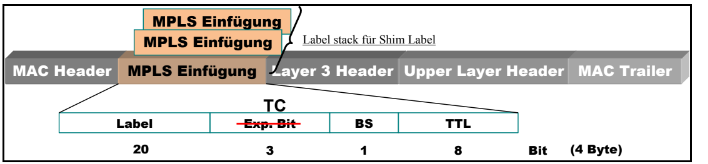
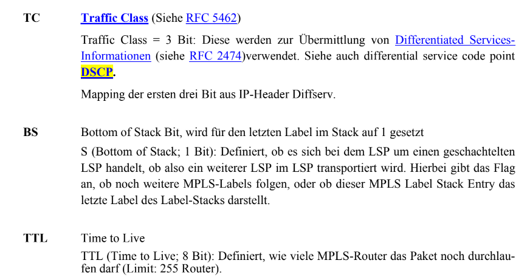
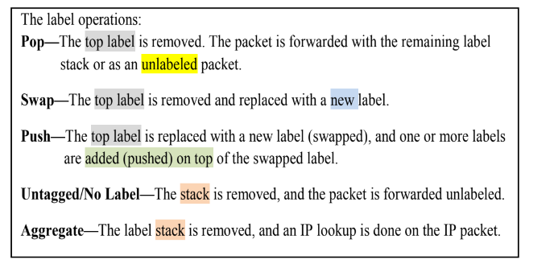
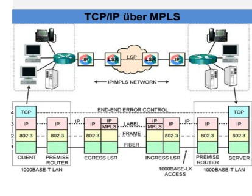
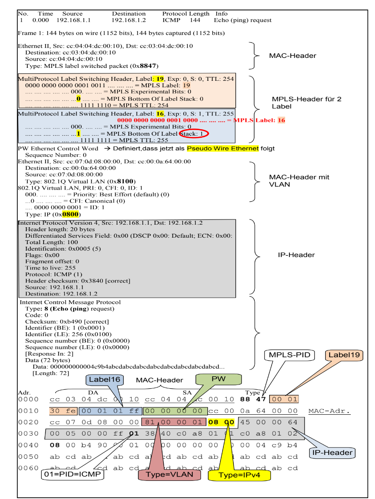

## MPLS

Multiprotocol Lable Switching

Schnelleres Weiterleiten von Paketen. Da die Header einfacher sind und nicht immer die Header komplett ausgewertet werden müssne.

Quasi ein Tunnelprotokoll, da damit verschiedene Dienste übermittelt werden können

## Frameformat allgeneuib

## FEC 

Forward Equivalent Class

Gruppe von Paketen die in der gleichen Art weitergeleitet werden.

Beim eintritt in ein MPLS Netz wird jedes Paket einer FEC zugewiesen.

FEC ermöglicht Zuordnung der Pakete und beschreibt wie sie weitergeleitet werdenmüssen.

## MPLS Label

Header die in Ethernet eingefügt werden.

Können gestackt (hintereinander) im Frame abgelegt werden.

Folgende Operationen auf den Stack sind möglich.

## LSP

Label Switching Path

Der Weg, den die MPLS Pakete durch das Netz nehmen sollen.

Kann direkt zum Nachbarrouter gehen oder über LSRs, die einen LSP mithilfe eines Label Signalisierungsprotokolls schalten.

## LER

Label Edge Router. Die Anfangs und Endpunkte eines LSPs

An ihnen verlassen/betreten Pakete das MPLS Netz.

Entfernen/Hinzufügen von Labels

## LSR

Label Switching Router.

High Speed Router im MPLS Netz, der daran beteiligt ist LSPs aufzubauen.
Etablieren den LSP durch das Netz.

Wie sie die Pakete weiterleiten müssen, erfahren sie über die Lable Tabelle

## CE

Customer Edge

Router des Kunden

## PE

Provider Edge

Übergangspunkt zum Provider. Zwichen Privider und Provider, aber auch Provider und Kunde.

## LAN encapsulation

Labels benutzen nur lokale Gültigkeit zwischen 2 LSRs

## TCP/IP über MPLs

## MPLS mit EMulation Trace

