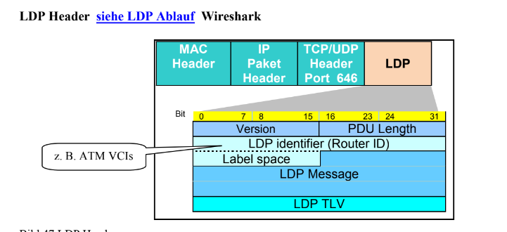
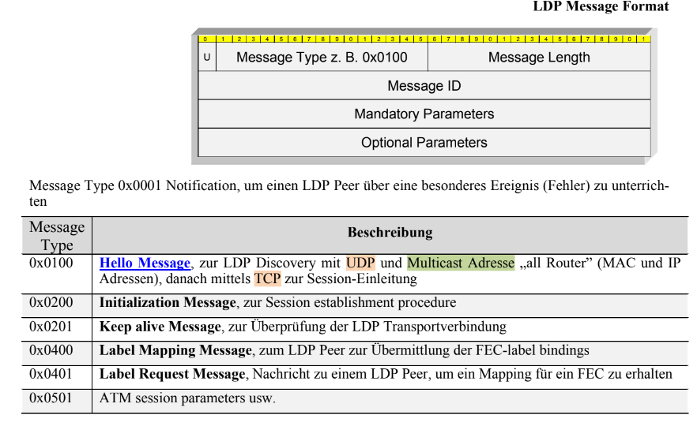
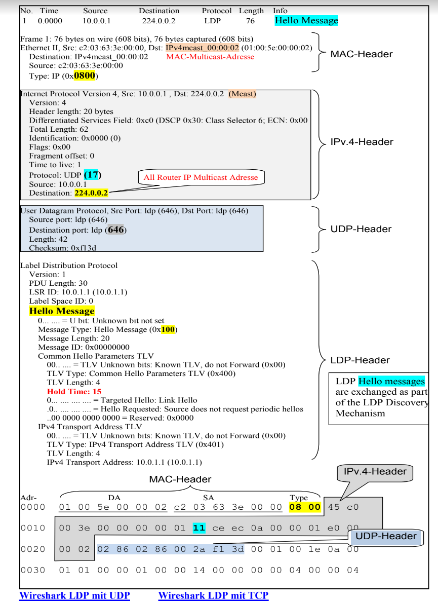

# Verteilung

## LIB Label Information Base

Label Tabelle in LSRs. Enthälkt Information wie das Label weitergeleitet werden soll.

## LDP Label Distribution Protokoll

Grundsätzlich: zwei LSRs verständigen sich über die Bedeutung der Labels.

Tauscht Zuordnung der Labels zu Pfaden aus.

Es kommunizieren immer benachbarte LSRs

## Label Distribution Modi

## LDP Header

l

## LDP Messages

lab

## LDP Discovery
Discovery message: kündigt das Vorhandensein von LSRs im Netz an,
## LDP Session MEssage
Session message: etabliert, erhält und beendet eine Session zwischen Peers,
## LDP Advertisment Message
Advertisement message: generiert, ändert und entfernt die Label Zuordnung für FECs,
## LDP Notification Essage
Notification message: stellt Zusatzinformationen und Fehlermeldungen zur Verfügung.

## LDP Trace

## MPLS-TP

MPLS Transport Profile Erweiterung. 

Reduzierung der Betriebskosten unter Beibehaltung der Effizient

## Pseudo Wire Emulation Edge-to-Edge

Emulationsdienst eines Netztes von Provider Edge zu Provider Edge über Packet Swichted Network

