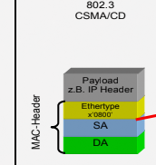
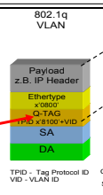
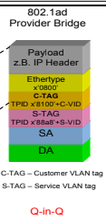

# Wichtige Standards im Metro/Carrier Ethernet

- 802.1ad Provider Bridge
- 802.1ah Provider Backbone Bridge
- 802.1q VLAN Bridge
- 802.3 CSMA/CD

## CSMA/CD

Standard Ethernet Header Format mit MAC Header

## 802.1q

Erster VLAN standard

Bis zu 4096 verschiedene VLANS sind möglich.

Dies wird durch ein zusätzliches Framefeld ermöglicht, dass den VLAN-Tag (Q-Tag) enthält.

## 802.1ad 

Ermöglicht das Double Stacked VLANs mit zwei 802.1q Tags (Erweiterung von 802.1q)

Ermöglicht darduch Trennung von VLANs des Providers und des Kunden.

Auch **Q in Q** genannt.

Hinter dem erste VLAN Tag wird ein zweiter VLAN Tag hinterlegt.

Damit sind 4096*4096 = ca. 16 Mio Tags. möglich.

Erster Tag = S-Tag = Service Tag
Zweiter Tag = C-Tag = Customer Tag (alter Q-Tag Header aus 802.1q)

Frameformat

## 802.1ah Provider Backbone Bridge

**Auch MAC in MAC  genannt**

Mit der Provider Backbone Bridge können Provider Netzte übergreifend gestaltet werden ohne die Integrität der Kundennetzwerke zu beinflussen.

MAC Adressen des Kunden und des Netzbetreibers sind getrennt.

Frameformat

2 Byte große Extended Service ID eingeführt = I-SID

Neue Struktur ist: MAC -> I-SID -> MAC -> S-TAG -> C-TAG -> Other Layers

## Q in Q Trace

