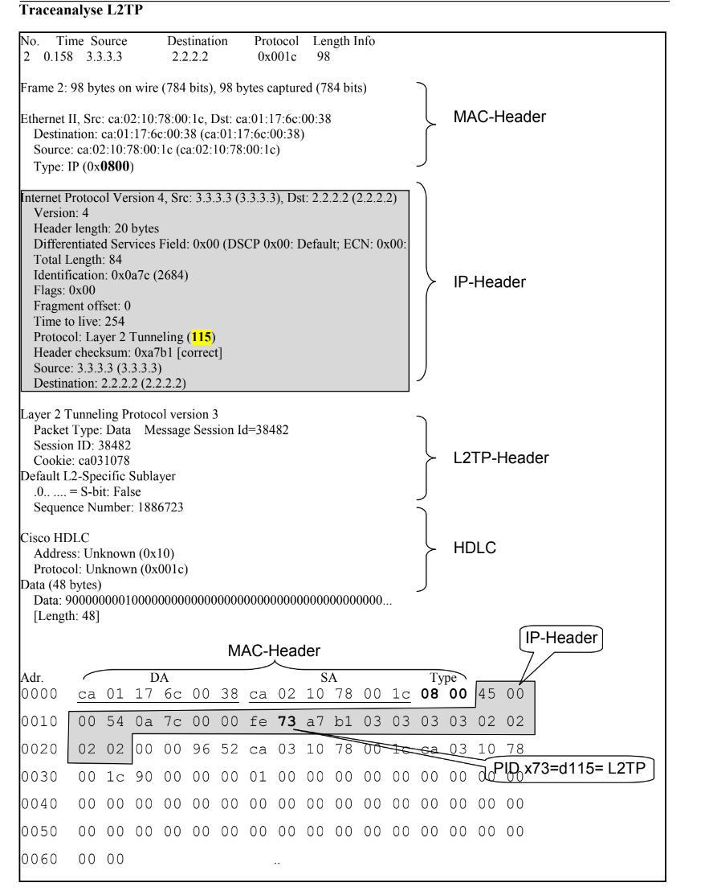

## L2TP

Erweiterung von PPTP

Alternative zu MPLS

Arbeitet mit UDP (layer 5) oder direkt IP (Layer 4)

Wenn direkt IP Protokoll ID 115

Die Nutzdaten werden also ungesichert in Klartext übertragen, sofern das Transport-Protokoll (PPP) keine
Verschlüsselung unterstützt oder nicht aktiviert wurde.

## L2TP Acess Concentrator (LAC)

Der LAC verwaltet die Verbindungen und stellt diese zum LNS her.

## L2TP Network Server (LNS)

Der LNS ist für das Routing und die Kontrolle der vom LAC empfangenen Pakete zuständig.#

## Tunnelszenarien
In beiden Fällen ist die Autorisierung und Authentifizierung von den Mechanismen im LAN abhängig.

-  Szenario 1: PPP Verbindung zwischen Client und LAC. LAC stellt Verbindung zum LNS her
-  Szenario 2: Direkte Unterstützung von L2TP auf dem LAC Client. (Wie PPTP PAC)

## L2TP Verbindungsaufbau

Call-setup
1. Der PC eines entfernten Benutzers initiiert
eine Anfrage nach einer Rufverbindung zur
LAC.

2. Der PC und der LAC führen PPP-LCP-
Verhandlungen durch.

3. Der LAC authentifiziert den PC-Benutzer mit

dem Challenge Handshake Authentication Pro-
tocol (CHAP).

4. Die LAC sendet Authentifizierungsinformati-
onen einschließlich Benutzername und Pass-
wort zur Authentifizierung an den RADIUS-
Server.

5. Nach der Authentifizierung des Benutzers sendet der RADIUS-Server das Authentifizierungs-
ergebnis an den Benutzer. An L2TP tunnel connection is set up between the LAC and LNS.

6. Zwischen LAC und LNS wird eine L2TP-Session-Verbindung aufgebaut.

7. Der LNS verarbeitet PPP-Verhandlungsinformationen, die in der Session-
Verbindungsanforderung enthalten sind.

8. Der LNS sendet eine Zugangsanfrage an seinen RADIUS-Server zur Authentifizierung.
9. Der RADIUS-Server sendet nach erfolgreicher Authentifizierung ein Antwortpaket.
10. (Optional) Der LNS führt eine sekundäre CHAP-Authentifizierung des entfernten Benutzers
durch.
11. Der LNS sendet sekundäre Authentifizierungsinformationen zur Authentifizierung an seinen
RADIUS-Server.
12. Der RADIUS-Server sendet nach erfolgreicher Authentifizierung ein Antwortpaket.
13. Eine L2TP-Verbindung wird aufgebaut und der LNS weist Remote-Benutzern IP-Adressen zu.

14. Der entfernte Benutzer kann mit den Geräten in der Zentrale kommunizieren und das LNS fun-
giert als Gateway.

## L2TP Trace

