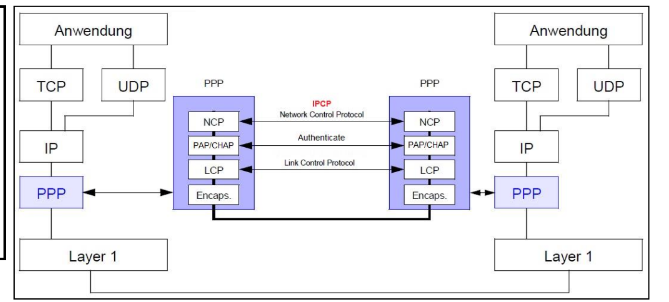
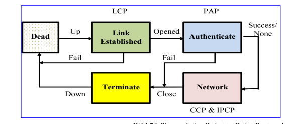
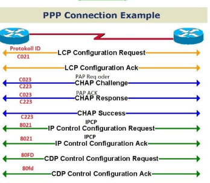
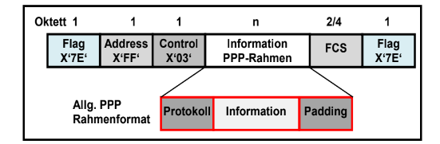
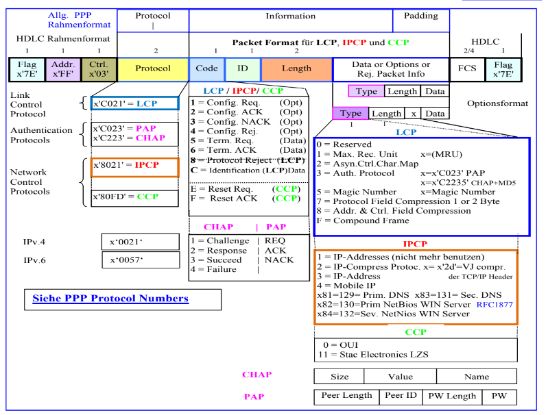
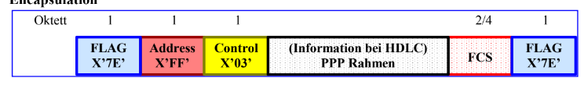
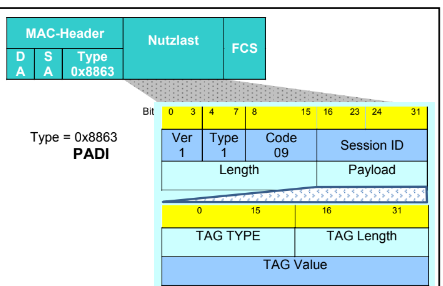
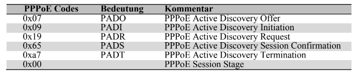
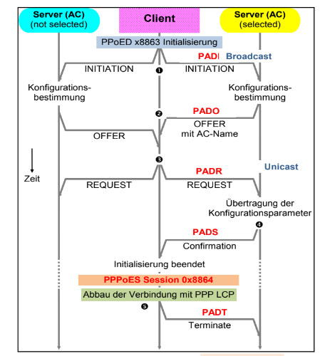

# Point to Point Protocol

RFC 1661

## Wesentliche Komponenten
-  Verfahren für Einschließen von Multi Protokoll Diagrammen
 - Link Control Protocl (LCP) 
 - Network Control PRotocols (NCP)

## Erweiterungen

- Kompression (CCP) RFC 1334
- Authentifizierung (PAP und CHAP) RFC 1962

## PPP Protokolle

- Encapsulation
- LCP (Link Control)
- PAP/CHAP (Authentifizierung)
- NCP (NEtwork Control Protocol)

## LCP
 
- Identifification  der rufenden Station bei der gerufenen Station (keine ANtwort notwendig) (Code Feld C)
- Link Configuration: Aushandelung der Parameter zur Konfiguration zwischen PC und Server
- Link Termination Abbau der Verbindung (Code-Feld 5)
- Link Maintenance Überprüfung der bestehenden Verbiindung

## PPP Header

- Protocol Field:  Nachfolgendes Protokoll (LCP oder IPCP)
- Information Field: Code für Funktionen, ID Identificaion, Längenangabe des Rahmens, Daten
- Padding field. Werden weniger Daten übertragen wird hier aufgegüllt

 

## LCP Header

## PPP Authentification

Nach LCP im PPP Header -> entweder PAP oder CHAP oder EAP

benutzen gleiches Frameformat wie LCP

## PAP

- Password Authentifizierung
- 2 Wege Prüfiung ohne Verschlüsselung des Passworts

## CHAP

- Challenge-Handschake Authentication Protokoll
- 3 Wege Handshke
- Authentifiziert CLients durch MD5 Prüfung eines vorher ausgetauschten Secrets

## EAP

- Ähnlich wie CHAP kann aber erweitert werden um andere Mechanismen zu erreichen

## NCP Protokolle

- Phase nach LCP
- Handelt Protokolle aus die PPP überträgt (bspw. IP)
- IPCP (für IP)

## PPP Phasen

- Dead: Keine Verbindung, Physical Layer nicht bereit
- Link Established: PPP Verbindung ausgehandelt aber noch keine Authentifizierung. Es werden LCP Configure Pakete ausgeetauscht ()
- Authenticate: Nach Link Established PAP oder CHAP wird ausgeführt. **Optional**
- Network: Verbindung komplett aufgebaut und Identifikation erfolgreich. Daten werden ausgtetauscht
- Terminate: Verbindung wird geschlossen. Mithilfe von LCP Kateten

## PPP Verbindungsaufbau Beispiel 1

## PPP Verbindungsaufbau Beispiel 2

## PPP Frame einfach

## PPP Frame mit allen Möglichkeiten

## PPP Frame in HDLC

- Flag Seqeuence = Wie bei HDLC
- Address Field: Stationsadresse 
- Control: Hex 03 (UI Frame) mit P/F Bit = 0
- PPP Informationenen
- FCS
- FLAG Sequence

## PPP over Ethernet

RFC 2516

- Standardisierung von PPP über Ethernet
- Zwischen Ethernet und PPP im OSI Modell
- MAC adressen beider Knoten notwendig, da bei Ethernet normalerweise jeder Knoten mit anderen reden kann
- Werden durch PPPoE Discovery (PPPoED) ausgetauscht (Phase 1)

## PPPoE Header 

Version = 1
Type = 1
Code = Wichtig für Disccovery (unterscheided die Discovery Phasen)
Session ID = Wird mit PADS vergeben und ist eindeutig für die Dauer der Session
Length = Größe der Nutzdaten
Payload = PPP Protocol und Nutzdaten

# PPPoE Phasen

- PPPoE Discovery (Ethernet Type: 0x8863)
- PPPoE Session (Ethernet Type: 00x8864)

## PPPoE Discovery

- Im Discovery Modus wird die MAC Adresse eines Access Concentrators ermittelt.

- Reihenfolge der Initialisierung:
    1. PADI (PPPoE Active Discovery Initiation) Client
    2. PADO (PPPoE Active Discovery Offer)  (Server)
    3. PADR (PPPoE Active Discovery Request) (Client)
    4. PADS (PPPOE Active Discovery Session-Confirmation)
    5. PADT (PPPoE Active Discovery Termination)

## PPPoE Session

