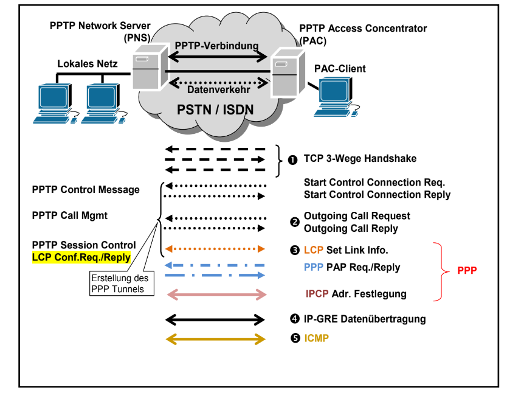
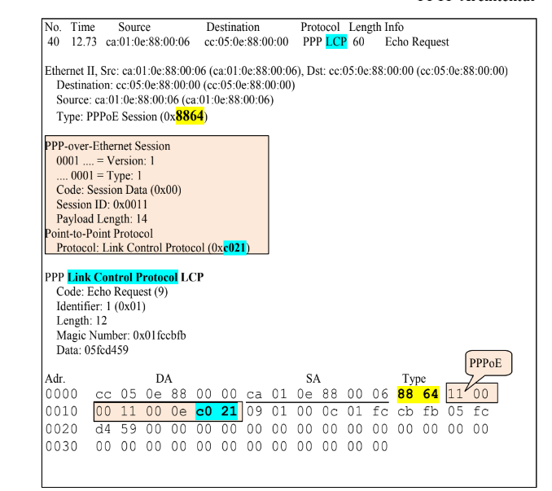
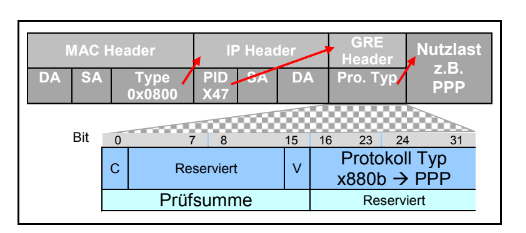

# PPTP

Vorgänger von L2TP

PPP wird durch IP Netz getunnelt. (Mithilfe von GRE)

und ist erweitert um Authenzifizierung, Komprimierung und Verschlüsselung.

RFC 2661

Layer 5

## Verbindungsaufbau 

1. TCP-3 Wege Handshake
2. PPTP COntrol Message (Start Control Connection Req.)
3. PPTP Call Mgmt
4. PPTP Sesion Control
5. PPP Conf. Req. (PPP LCP)
6. PPP PAP/CHAP
7. PPP IPCP
9. IP-GRE Übertragung

## PPTP Trace

## PAC PPTP-Access Concentrator

Endpunkt am Client, der die Pakete annimmt. Bekommt lokale IP aus dem LAN zugewisen.

Er stellt die Verbindung mit dem Server her.

Nach Authentifizierung und Autorisierung schickt er die Pakete an den PNS.

Dies geschieht durch das Einpacken der PPP Pakete in einen GRE Tunnel

Eine Verschlüsselung findet nicht statt. Daher muss bereits bei PPP die Verschlüsselung ausgehandelt wer-
den.

## PNS PPTP NEtwork Server

Nimmt die Verbindungen vom PAC entgegen und ist für das Routing und die Kontrolle zuständig.

## PPTP Header

